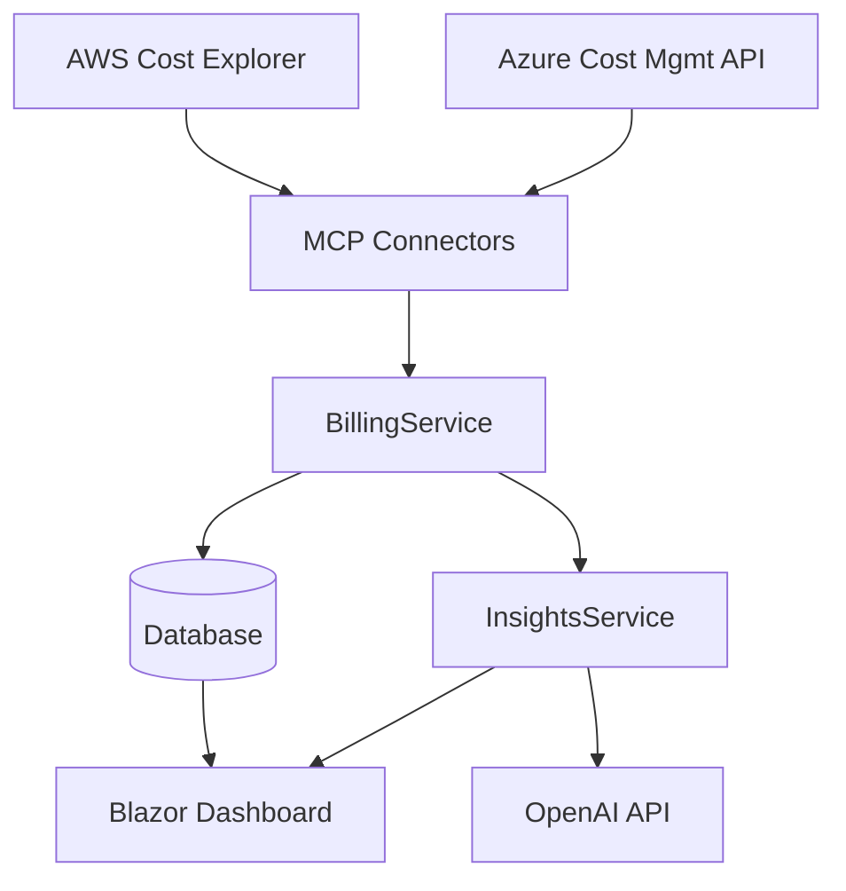

# 🌍 Cross-Cloud AI Cost Advisor

**Cross-Cloud AI Cost Advisor** is a **.NET + Blazor dashboard** that aggregates **AWS and Azure cloud costs**, normalizes the data, and generates **AI-powered insights** for smarter cost management.  

This project bridges the gap between siloed billing consoles by providing a **unified multi-cloud view** with **narrative recommendations**.

---

## ✨ Features (MVP)

- 🔄 Fetch AWS (Cost Explorer) and Azure (Cost Management) billing data  
- 🗂 Normalize costs into a single unified schema  
- 📊 Blazor dashboard with:  
  - Cost by provider (AWS vs Azure)  
  - Monthly cost trend (line graph)  
- 🤖 AI-powered recommendations (OpenAI)  
- ⚙️ Automated daily sync (Hangfire / Quartz.NET)  

---

## 🏗️ Architecture (MVP)



## 📂 Project Structure

```
cross-cloud-ai-cost-advisor/
 ├── src/
 │   ├── CostAdvisor.API/            # ASP.NET Core Web API
 │   ├── CostAdvisor.UI/             # Blazor Server frontend
 │   ├── CostAdvisor.Core/           # Business logic, connectors, services
 │   └── CostAdvisor.Infrastructure/ # Persistence, DB, config
 ├── tests/
 │   └── CostAdvisor.UnitTests/      # Unit tests
 ├── docs/                           # Architecture docs, diagrams
 ├── README.md
 └── LICENSE
```

## 🚀 Getting Started


1. Clone the Repository
```
git clone https://github.com/your-username/cross-cloud-ai-cost-advisor.git
cd cross-cloud-ai-cost-advisor
```

2. Configure Credentials

Create appsettings.json (or use environment variables):
```
{
  "AWS": {
    "AccessKey": "your-access-key",
    "SecretKey": "your-secret-key",
    "Region": "us-east-1"
  },
  "Azure": {
    "TenantId": "your-tenant-id",
    "ClientId": "your-client-id",
    "ClientSecret": "your-client-secret",
    "SubscriptionId": "your-subscription-id"
  },
  "OpenAI": {
    "ApiKey": "your-openai-key"
  },
  "Database": {
    "ConnectionString": "Server=localhost;Database=CostAdvisor;User Id=sa;Password=yourpassword;"
  }
}
```
3. Run API
```
cd src/CostAdvisor.API
dotnet run
```

4. Run UI
```
cd src/CostAdvisor.UI
dotnet run
```
5. Open in Browser

👉 http://localhost:5000

---

## 🔄 Roadmap

 Add GCP billing integration

 Forecasting with AI narrative reports

 Custom rules engine & alerts (Slack/Teams)

 Multi-tenant support for enterprises

 Docker + Kubernetes deployment


## 🛠 Tech Stack

---

.NET 8 (ASP.NET Core Web API, Blazor Server)

AWS Cost Explorer API

Azure Cost Management API

PostgreSQL / SQL Server

OpenAI GPT (recommendations)

Hangfire / Quartz.NET (scheduling)

---

## 🤝 Contributing

Contributions, issues, and feature requests are welcome!
Feel free to open a PR or create an issue.

## 📜 License

This project is licensed under the Apache 2.0 License – see the LICENSE file for details
